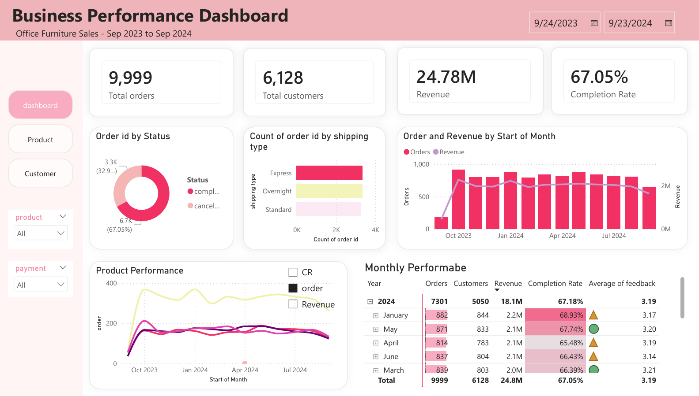

# Office Furniture Sale Analytics

## Overview
End-to-end data analytics project on e-commerce office furniture transactions (Sep 2023 – Sep 2024). Covers ETL, EDA, Power BI dashboard, and RFM customer segmentation with K-Means clustering.

## Tech Stack
Python (Pandas, NumPy, Scikit-learn, Matplotlib, Seaborn) · Power BI (Power Query, Dax) · Jupyter Notebook

## Dataset
5 relational tables — `orders` (9,999 rows), `customer`, `product`, `payment`, `shipping`.

## Repository Structure
```
├── data/
│   ├── raw/                        # Original CSVs
│   └── processed/                  # Cleaned & merged tables
├── notebooks/
│   ├── 01_EDA.ipynb                # Exploratory Data Analysis
│   └── 02_RFM_Analysis.ipynb       # RFM + K-Means Segmentation
├── scripts/
│   └── etl_pipeline.py             # Extract → Transform → Load
├── dashboard/
│   ├── powerbi_dashboard.pbix      # Using raw data
│   └── dashboard_preview.png
├── requirements.txt
└── README.md
```

## Dashboard Preview


## Quick Start
```bash
pip install -r requirements.txt
python scripts/etl_pipeline.py
```
Then open the notebooks in `notebooks/` to explore the analysis.
